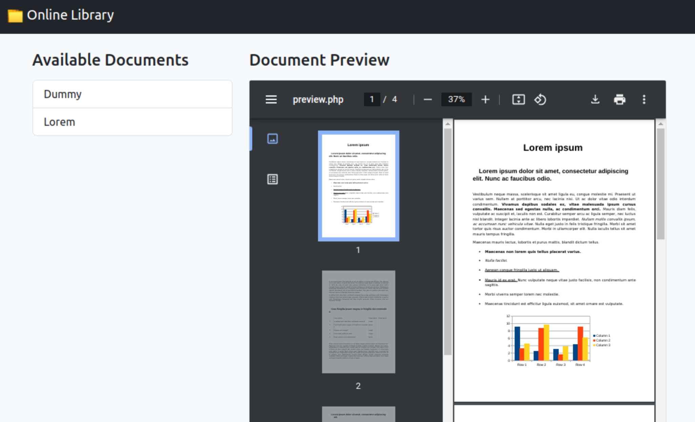
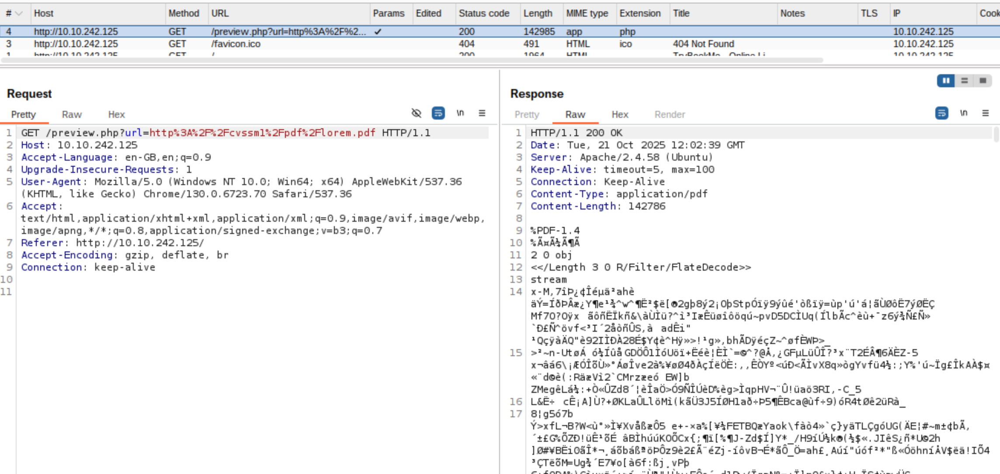

# 🕵️ Extract

* Solving [EXTRACT](https://tryhackme.com/room/extract)

## Discovery

1. First of all, Lets Find Open Ports: `nmap -p- -sV $TARGET`
```
Nmap scan report for $TARGET
Host is up (0.00024s latency).
Not shown: 65533 closed ports
PORT   STATE SERVICE VERSION
22/tcp open  ssh     OpenSSH 9.6p1 Ubuntu 3ubuntu13.11 (Ubuntu Linux; protocol 2.0)
80/tcp open  http    Apache httpd 2.4.58 ((Ubuntu))
MAC Address: 02:79:29:14:25:7F (Unknown)
Service Info: OS: Linux; CPE: cpe:/o:linux:linux_kernel
```

2. By checking Web Port(**80**) with `http://$TARGET`, It seems PDFs  are loaded From: `http://$TARGET/preview.php?url=http%3A%2F%2Fcvssm1%2Fpdf%2Fdummy.pdf`. Possibly the website is vulnerable to **Path Traversal** or **SSRF**




