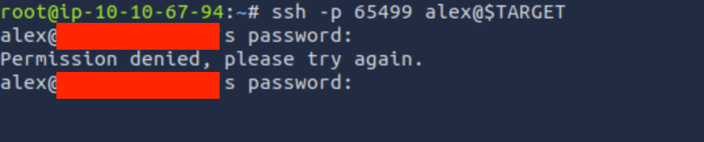
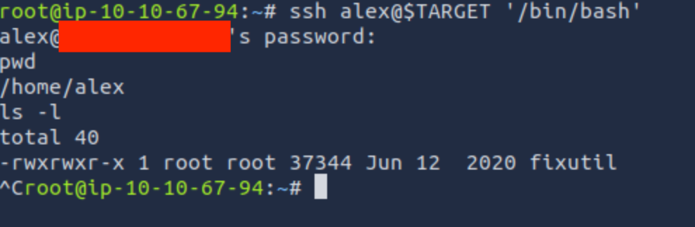
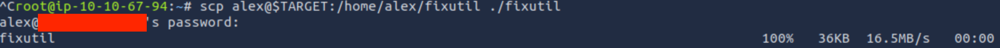
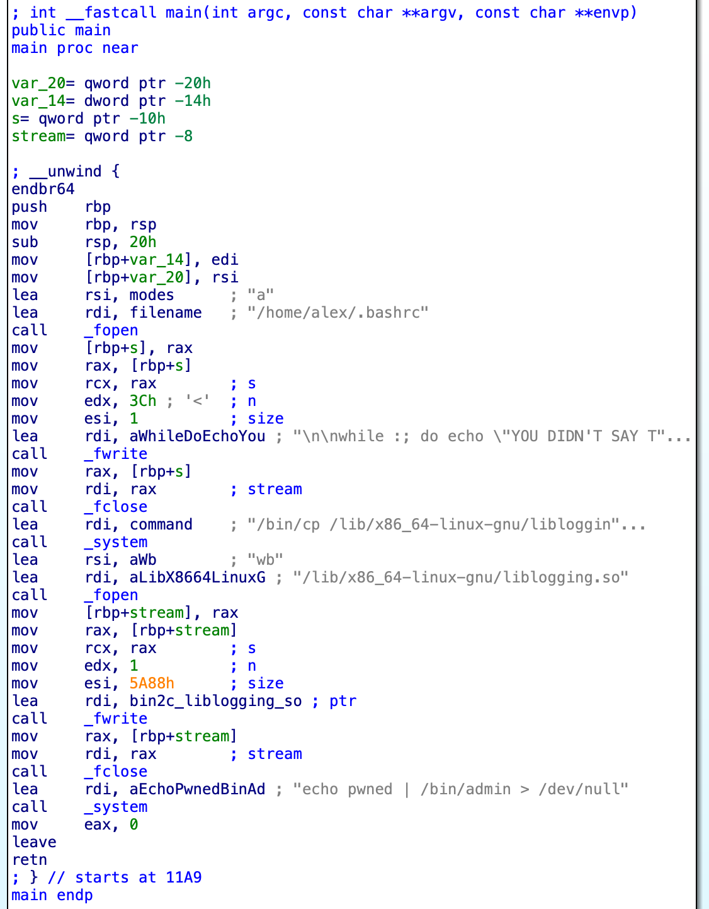
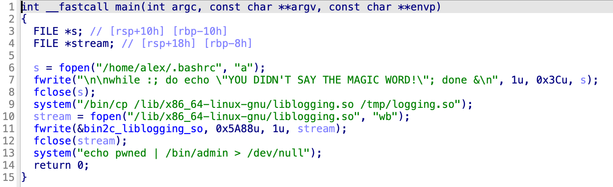
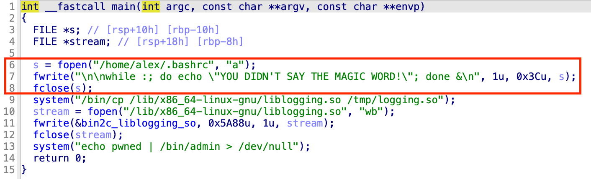
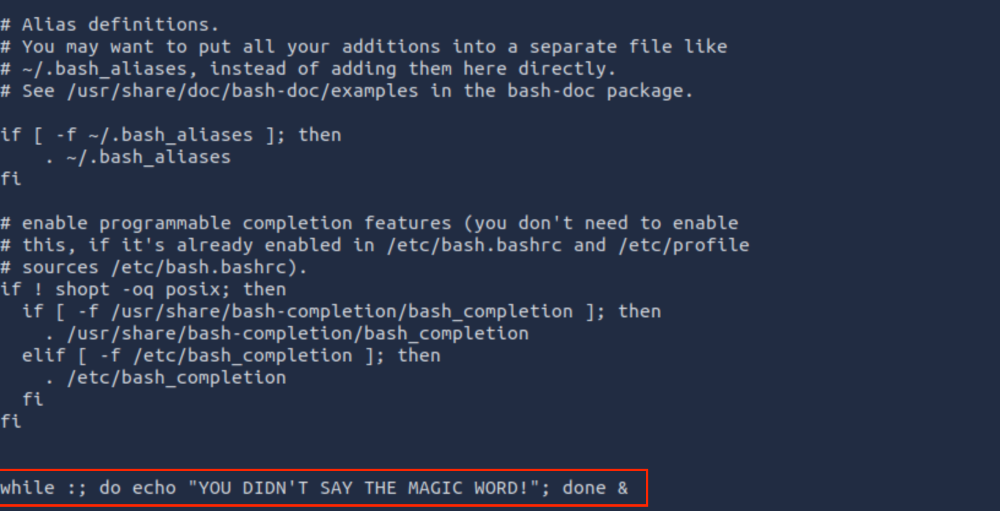
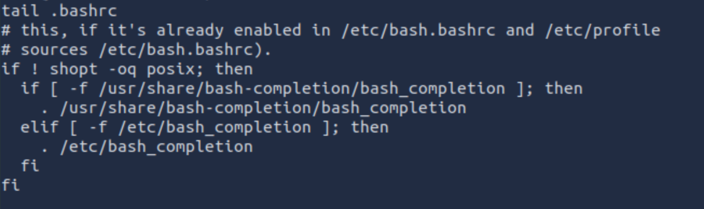
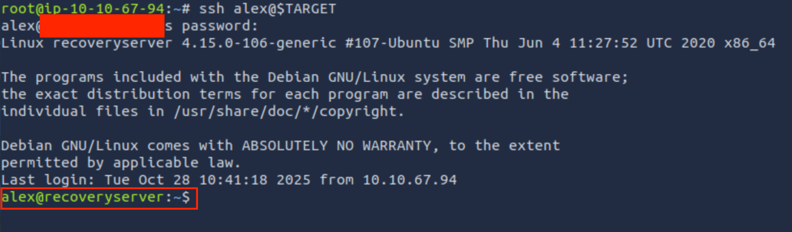
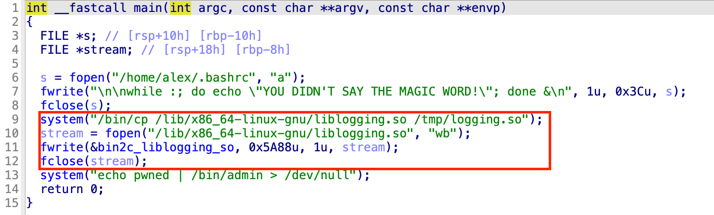

# ♻️ Recovery

* Solving [Recovery](https://tryhackme.com/room/recovery)

## 🔥 Introduction

💀 **Ransomware** is no longer a distant, abstract threat—it’s a personal disaster waiting to happen, as Alex from Recoverysoft learned the hard way. 💻 What began as a routine email from a trusted colleague quickly spiraled into chaos: a simple click, a harmless-looking “fix” binary, and within hours, his company’s Ubuntu web server was locked down by a mocking message ⚠️ `YOU DIDN’T SAY THE MAGIC WORD!` With files encrypted 🔒, SSH blocked 🚫, and backdoors lurking in system libraries 🧨, Alex’s nightmare encapsulates the deceptive power and devastating impact of modern ransomware. His story serves as a stark reminder ⚔️ that in today’s digital world, trust can be weaponized, and one careless command can bring an entire system to its knees. 🕹️


Now Alex, Asks US to recover ♻️ accessing his server and 🗂️ files with following credentials:
```
Username: alex
Password: madeline
```

* **Attention**: After solving each section, ⛳️ flags will show up in: `http://$TARGET:1337`

## 🔎 Discovery

1. 🎯 First of all, Let's see what is going on this server: `nmap -p- -sV $TARGET`
```
Nmap scan report for $TARGET
Host is up (0.00024s latency).
Not shown: 65531 closed ports
PORT      STATE SERVICE VERSION
22/tcp    open  ssh     OpenSSH 7.9p1 Debian 10+deb10u2 (protocol 2.0)
80/tcp    open  http    Apache httpd 2.4.43 ((Unix))
1337/tcp  open  http    nginx 1.14.0 (Ubuntu)
65499/tcp open  ssh     OpenSSH 7.6p1 Ubuntu 4ubuntu0.3 (Ubuntu Linux; protocol 2.0)
MAC Address: 02:1C:A6:53:A7:95 (Unknown)
Service Info: OS: Linux; CPE: cpe:/o:linux:linux_kernel
```

2. 😵 Logging in SSH gives us a repeatitive sentence:
```sh
ssh alex#$TARGET
...
YOU DIDN'T SAY THE MAGIC WORD!
...
```


3. ☹️ There is another SSH on port **65499** but we couldn't login.



4. 😎 SSH could be Forced to execute another binary immediately after login. This helps logging in and Finding the malware.
```ssh
ssh alex@$TARGET '/bin/bash'
```



5. 🚀 `scp` is a suitable command for downloading it.
```
scp alex@$TARGET:/home/alex/fixutil ./fixutil
```



* **Attention**: Binaries of this challenge are already downloaded and included in this [Directory](files/).

## ⛳️ Reverse Engineering: Flag 0

6. 🐞 Open `fixutil` File in **IDA Free** (There is a free version of [**IDA Pro**](https://hex-rays.com/ida-free))



7. Pressing **F5** in IDA will show Us the **decompiled** code.



8. Lines 6 to 8, show additon of a `while` loop into `.bashrc` and avoid loading `/bin/bash` on SSH login.
```
\n\nwhile :; do echo \"YOU DIDN'T SAY THE MAGIC WORD!\"; done &\n
```



09. Checking `.bashrc` file proves the assumption.



10. Lets remove **JUNK** lines, It'll help us login using **SSH** properly.
```sh
# cut top 114 lines in .bashrc and ditch modified ones
head -n 114 .bashrc > temp.rc
# check temp.rc file, if everything is OK!?
mv temp.rc .bashrc
```



11. Fixing this issue, solves the SSH login problem and reveals the ⛳️ Flag 0 on: `http://$TARGET:1337/`



## ⛳️ Reverse Engineering: Flag 2

12. Another Modified file is: `/lib/x86_64-linux-gnu/liblogging.so`



13. But, File `/tmp/logging.so` does not exist. We could find it somewhere else:
```sh
ls -l /lib/x86_64-linux-gnu/ | grep log
-rwxrwxrwx 1 root root   23176 Jun 17  2020 liblogging.so
-rwxr-xr-x 1 alex alex   16048 Jun 17  2020 oldliblogging.so
```

14. `liblogging.so` is definietly another stage of malware, we can't recover the server without getting it using `scp`.
```
scp alex@$TARGET:/lib/x86_64-linux-gnu/liblogging.so ./liblogging.so
```

15. In the end of this section, `liblogging.so` should be replaced with OLD one (As step **13** shows, Current user has Permissions to do it).
```sh
cp /lib/x86_64-linux-gnu/oldliblogging.so /lib/x86_64-linux-gnu/liblogging.so
```

16. Flag 2 reveals in the panel: `http://$TARGET:1337/`

# ⛳️ Reverse Engineering: Down to 🐰 Rabbit Hole 🕳️

17. Last Modified File is `/bin/admin` which the malware adds:


20. Dumping it with `scp`.
```
scp alex@$TARGET:/bin/admin ./admin
```

21. RE this file and You'll See It has a SImple Password but no Flags Here!

22. It seems there is nothing to follow here!

# ⛳️ Reverse Engineering: Flag 1

23. Malware writes `brilliant_script.sh`

24. Read it: `cat /opt/brilliant_script.sh`
```sh
#!/bin/sh

for i in $(ps aux | grep bash | grep -v grep | awk '{print $2}'); do kill $i; done;
```

25. Removing and Empty File:
```sh
# Removing Last Line
head -n 2 /opt/brilliant_script.sh > /opt/brilliant_script.sh
```

26. This fixes the accidental shell closing and Gives Flag 1

## Switching to user ROOT

27. Check `sudo` version: `sudo --version`

28. It is vulnerable to with exploit: [CVE-2021-3156](https://github.com/Mhackiori/CVE-2021-3156)

29. Moving Files to **$TARGET**

30. Use `Makefile` script to build the files.


## ⛳️ Reverse Engineering: Privilege Escalation and Flag 3

1. CronJob Added in `liblogging.so` to exec: `/opt/brilliant_script.sh`

2. It runs as `root` and we have access to it.

3. Create ssh key
```sh
ssh-keygen
# generates public/private keys
cat id_rsa.pub # you may choose another name for file!
# ssh-rsa AAAA ... root@computer-name
```

4. change `computer-name` in the end of ssh key to `recovery` and use `/opt/brilliant_script.sh` to add your ssh key to root:
```ssh
echo 'echo "ssh-rsa AAAA...U= root@recovery" > /root/.ssh/authorized_keys' >> /opt/brilliant_script.sh
```

5. In code, SSH Key added for root, If you remove it, Flag 3 Appears in step above!

## ⛳️ Reverse Engineering: Flag 4

1. in code, user `security` added

2. delete user: `userdel -f security`

## ⛳️ Reverse Engineering: Flag 5

1. Malware uses **XOR** for encryting Files and saves the KEY inside: `/opt/.fixutil/backup.txt`

2. use AI to generate code for decryption, It gave me this file
```
malware encrypted my files in: /usr/local/apache2/htdocs/
I found the key in: /opt/.fixutil/backup.txt
encryption algorithm is: xor
help me with a code in C to decrypt them
```
3. use nano to write it on target in the name of `xor_decrypt`

4. lets build it on target and run it:
```sh
gcc -O2 -Wall -o xor_decrypt xor_decrypt.c -std=c11 -D_XOPEN_SOURCE=700

# Test and Dry run:
./xor_decrypt --key /opt/.fixutil/backup.txt --target /usr/local/apache2/htdocs --dry-run

# Actual Run
sudo ./xor_decrypt --key /opt/.fixutil/backup.txt --target /usr/local/apache2/htdocs
```

5. Check the Web Pages and It is UP!

6. You get Flag 5 Here!